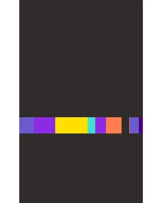

# nightjet

> Evening conversations with and about AI. Aiming for 100 little programs and
> conversations about code, with various models.

Some goals are to

* write a few small programs *together with AI* that I wanted to write forever,
* systematically explore some of the boundaries of the current AI models regarding programming,
* prototype some real (web) applications and ship it,
* try to think of some *useless* programs that I still find interesting, and implement them.

## DONE

* [x] a program that generates a notebook gif, with a colorful band

* [x] basic text to [gif](x/textgif1/output.gif)
* [x] trcli, a quick trello cli for listing cards on a board plus summary [demo](x/trcli/trcli-demo.gif)

## TODO

* [ ] a TUI for language learning, drill, not too fancy, with some gaming aspect
* [ ] a TUI for learning alphabets: hebrew, greek, cyrillic
* [ ] a TUI for learning the N most used chinese characters, or hangul, or kanji
* [ ] a simple desktop application that revolves around the "TAFELWERK" - learn about a topic, or solve some questions with a builtin equation editor
* [ ] a CLI for exploring a text corpus of a foreign language, ranking sentences by difficulty, automatic translation
* [ ] an simple "appointment scheduler for hackers", with webpage and CLI first approach, "[cali](https://github.com/miku/cali)"
* [ ] a reprise on norvig UNIX help system article from 2001: https://research.google/pubs/intelligent-help-systems-for-unix/
* [ ] a TUI that allow to navigate a citation graph in some cool way
* [ ] a set of psychometric tests for the command line (similar to canny)
* [ ] an iOS app that would cache the audio of YT video for later listening (saving bandwidth, etc)
* [ ] a program that takes the curricula for elementary school, and compiles a workbook with related themes
* [ ] a program that looks like the S-Bahn station: L Bayerischer Bahnhof
* [ ] a theme: "this library does not exist", a mostly generated website, for the @kitt group
* [ ] a theme: "this book does not exists", description of book, excerpts and reviews, but no book
* [ ] a set of animation helpers to build gifs, or webms; "21st century gif", 21STWM, "21stwebm"
* [ ] a web site that helps you to analyze your github CI runs and failures quickly, like gh-workflow-stats
* [ ] a RAG for support chat over documents
* [ ] A RAG for catalog metadata
* [ ] A metadata completion tool (do a fine tune over metadata that is correct and then blank out known fields), maybe relate to the theme of metadata quality
* [ ] write a pure Go version of wapiti
* [ ] something like cbonsai, but for palm tree (wip)
* [ ] tailpdf, tool that "reads" (papers) pdfs I download and amends a "RESEARCH.md" document with some finding, highlighted excerpts, maybe responding to a question in the document
* [ ] a TUI to navigate a large (2B+) graph structure in an intuitive way, like ranger
* [ ] a website that given a research pdf will find all links and archive them
* [ ] a data format conversion tool, mapping source to target schema by examples
* [ ] grepcity, grep through random pics
* [ ] maze generation
* [ ] cloud library, spreadsheet as a catalog
* [ ] email drafter with n8n
* [ ] bookdna, cli

## Models

* [Codestral](https://ollama.com/library/codestral:22b), via [Chat AI](https://arxiv.org/abs/2407.00110)
* [DeepSeek-R1-Distill-Llama-8B](https://huggingface.co/deepseek-ai/DeepSeek-R1-Distill-Llama-8B), via [blablador](https://helmholtz-blablador.fz-juelich.de/)
* [Claude](https://en.wikipedia.org/wiki/Claude_(language_model))
* [Gemini](https://gemini.google.com)
* [Chatgpt](https://chatgpt.com)

## Readings

* [CS224g: Code generation with LLMs](https://web.stanford.edu/class/cs224g/slides/Code%20Generation%20with%20LLMs.pdf)
* [Google DeepMind: Large Language Models for Code Generation](https://rdi.berkeley.edu/responsible-genai/assets/LLM_codegen_lecture.pdf)
* [ChatGPT Prompt Patterns for Improving Code Quality, Refactoring, Requirements Elicitation, and Software Design](https://www.dre.vanderbilt.edu/~schmidt/PDF/prompt-patterns-book-chapter.pdf)
* [Prompt Patterns for Structured Data Extraction from Unstructured Text](https://www.dre.vanderbilt.edu/~schmidt/PDF/Prompt_Patterns_for_Structured_Data_Extraction_from_Unstructured_Text.pdf)
* [Foundations of Large Language Models](https://arxiv.org/pdf/2501.09223)

## Misc

* [Everything I built with Claude Artifacts this week](https://simonwillison.net/2024/Oct/21/claude-artifacts/)
* [How I program with LLMs](https://crawshaw.io/blog/programming-with-llms)

