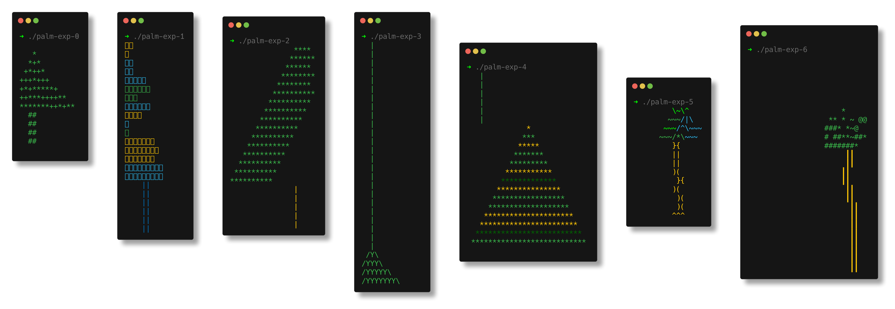

# Beyond Benchmarks: Human x LLM for (Go) Code (intermediate report)

> 2025-05-27, [Leipzig Gophers](https://golangleipzig.space) #51, Martin Czygan

## Motivation

* not really convinced, but tried to make a more systematic effort to use
  coding tools since BOY 2025 - and to try to document the process:
[nightjet](https://github.com/miku/nightjet)

Testing various open models:

* codestral-22b,deepseek-r1
* gemma-3-27b-it
* llama-3.3-70b-instruct
* mistral-large-instruct
* qwen2.5-coder-32b-instruct
* qwen3-32b

| Organization                     | Model                               | Open | Knowledge cutoff | Context window in tokens | Advantages                                                        | Limitations                | Recommended settings                    |
|----------------------------------|-------------------------------------|------|------------------|--------------------------|-------------------------------------------------------------------|----------------------------|-----------------------------------------|
| 🇺🇸 Google                      | Gemma 3 27B Instruct                | yes  | Mar 2024         | 128k                     | Vision, great overall performance                                 | -                          | default                                 |
| 🇨🇳 Alibaba Cloud               | Qwen 3 32B                          | yes  | Sep 2024         | 32k                      | Good overall performance, multilingual, global affairs, logic     | -                          | default                                 |
| 🇨🇳 DeepSeek                    | DeepSeek R1                         | yes  | Dec 2023         | 32k                      | Great overall performance, reasoning and problem-solving          | Censorship, political bias | default                                 |
| 🇺🇸 Meta                        | Llama 3.3 70B Instruct              | yes  | Dec 2023         | 128k                     | Good overall performance, reasoning and creative writing          | -                          | default, temp=0.7, top_p=0.8            |
| 🇫🇷 Mistral                     | Mistral Large Instruct              | yes  | Jul 2024         | 128k                     | Good overall performance, coding and multilingual reasoning       | -                          | default                                 |
| 🇫🇷 Mistral                     | Codestral 22B                       | yes  | Late 2021        | 32k                      | Coding tasks                                                      | -                          | temp=0.2, top_p=0.1, temp=0.6, top_p=0.7|
| 🇨🇳 Alibaba Cloud               | Qwen 2.5 Coder 32B Instruct         | yes  | Sep 2024         | 128k                     | Coding tasks                                                      | -                          | default, temp=0.2, top_p=0.1            |

* prompt engineering is really model training (or "[in-context learning](https://arxiv.org/pdf/2301.00234)"), it
  just does not necessary feel that way

> It has been a significant trend to explore ICL to evaluate and extrapolate
> the ability of LLMs. [A Survey on In-context
> Learning](https://arxiv.org/pdf/2301.00234) (2024)

Other:

* SWE-Bench (2023): https://arxiv.org/pdf/2310.06770, https://github.com/SWE-bench/SWE-bench, https://www.swebench.com

> To this end, we in- troduce SWE-bench, an evaluation framework consisting of
> 2,294 software engi- neering problems drawn from real GitHub issues and
> corresponding pull requests across 12 popular Python repositories. Given a
> codebase along with a description of an issue to be resolved, a language
> model is tasked with editing the codebase to address the issue

> Our evaluations show that both state-of- the-art proprietary models and our
> fine-tuned model SWE-Llama can resolve only the simplest issues. The
> best-performing model, Claude 2, is able to solve a mere 1.96% of the issues

* SWE-Bench+ (2024): https://arxiv.org/pdf/2410.06992

## TL;DR

* so far, both: HITS and MISSES
* feels like early Stack Overflow (SO), helpful to fill in missing pieces; augmentation to docs
* throwaway code, prototypes, able to skip stuff I am not interested in
* just like SO, it's all fine as long as you understand every line (up to some granularity)

## trcli

Wanted to have a CLI tool for accessing TRELLO board and printing out.

* 185 lines of code, [claude/chat](https://claude.ai/chat/79da6368-24b9-4d17-bbf7-df57b0219b3b)


## cli palm tree

* I love palm trees and the cli
* can I get a palm tree into my terminal?

Short answer: not really




### llmexp

Wrote llmexp to run the same query against different models.

```
$ ./llmexp -endpoint example.com/v1/chat/completions -models
llama-3.3-70b-instruct,gemma-3-27b-it,mistral-large-instruct,qwen3-32b,qwen2.5-coder-32b-instruct,codestral-22b
-user-file experiments/exp-0000.md -save-md ...
```

## api refactoring

* use of transitioning from one API to another, tedious repetitive rewrite; test available
* mostly helpful

## metha feature

* command line harvester for XML data; wanted zstd support
* codebase existing and familiar
* overall useful, somewhat easier to review code; need backwards compatibilty and one function needed more parameters
* 181 SLOC of migration script; to port existing cache from gzip to zstd; one-time, low risk operation (it is only a cache; saved bandwidth); required additional review for special case

The LLM suggested compression level, but I really did not care about that.

```go
// Helper to add the appropriate extension based on compression type
func compressedFilename(base string, compressionType CompressionType) string {
        switch compressionType {
        case CompZstd:
                return base + ".zst"
        default:
                return base + ".gz"
        }
}
```

Changed less than 100 SLOC.


```
$ git diff --stat 0a5555b4 -- harvest.go client.go cmd/metha-sync/main.go
 client.go  | 27 ++++++++++++++++++++++++---
 harvest.go | 40 ++++++++++++++++++++++++++++++++++++----
 2 files changed, 60 insertions(+), 7 deletions(-)
```

## replace.c port to Go

* Claude 4, Gemini 2.5 (flash, pro) did not crack it
* step by step approach
* Claude 4 and Gemini 2.5 had very different styles; more idiomatic Go, more close to C
* at the end Claude 4 suggested to through away everything and just use
  "strings.Replace" - it did not suggest
[strings.NewReplacer](https://pkg.go.dev/strings#NewReplacer), which should be
faster


## random insights

> Looking at the debug log, I can see the issue clearly.

> Looking at the debug output, the core issue is that the DFA construction is
> fundamentally broken. Let me provide a much simpler approach that focuses on
> getting basic string replacement working without the complex DFA
> construction:

## extra tools

* There is gitingest, a cli to format your project for a prompt

```shellshell
$ uvx gitingest -o digest.txt

$ head -40 digest.txt
Directory structure:
└── repoctx/
    ├── README.md
    ├── LICENSE
    ├── Makefile
    ├── repoctx
    └── repoctx.go

================================================
File: README.md
================================================
# repoctx

Convert a git repo into an LLM friendly format.

## TODO

* [ ] clone if url
* [ ] find files, parse gitignore, git info exclude
* [ ] render a tree structure
* [ ] add files

Additional considerations:

* [ ] try to run a test suite
* [ ] do some static analysis
* [ ] do some go vet
* [ ] do some grammer checks


================================================
File: LICENSE
================================================
MIT License

```

## TODO

### more systematic experiments

At least three axes:

* [ ] model
* [ ] prompt
* [ ] context (file, repo, additional documentation)

### iterative development

A loop.

* prompt, with task
* sandboxed runtime to run tool
* gather output, errors messages
* feed error, output to next prompt
* some stopping condition


