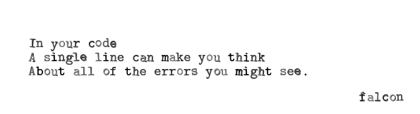
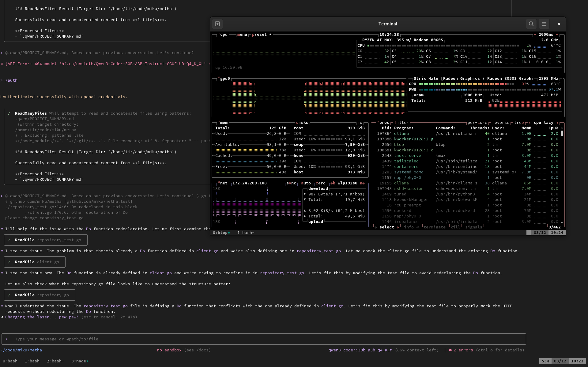

# coding with ai tools, personal recap


* 20XX: had fun with markov chains
* 2021: first encounter with Copilot during beta, "funny toy"
* 2022: chatgpt, while teaching programming
* 2023: small bits and pieces, more concerned with local setup, cf. [haiku](https://golangleipzig.space/posts/meetup-35-wrapup/), [ollama testdrive](https://github.com/miku/localmodels)

[](https://golangleipzig.space/meetup-38-llm-haiku/meetup-38-llm-haiku.pdf)

* 2024: mostly ignored, little use among [some peers](https://golangleipzig.space/posts/meetup-44-wrapup/)
* 2025: try more earnest, [nightjet](https://github.com/miku/nightjet), pro
  subs (mistral, claude, gemini), [too
flaky](https://golangleipzig.space/posts/meetup-51-wrapup/), trying agentic
code tools, wrote a [dummy agent](https://github.com/miku/unplugged), local
preferred; lots of fails, some hits, "comprehension debt", ok for docs sometimes, e.g. [deepwiki](https://deepwiki.com/ollama/ollama)
* 2026: expect moderate use

Overall AI resentments, e.g.

* https://bsky.app/profile/mattadvance.bsky.social/post/3m6kny6ijfs2o

<!--

-->

Current assessment:

* great for throwaway code ("[you will, anyway](https://wiki.c2.com/?PlanToThrowOneAway)"), trcli, apodwall, minimalwave, ...
* I like another pair of eyes for debugging; point out potential issues, etc.
* quick usage examples, if I am too lazy to read the docs thoroughly

Somehow it seems to work best, where we already accumulated some debt; like a
tricky codebase or incomplete documentation. It works best for things that
probably should not be there in the first place.

* probably good for the scientific field, which runs on throwaway code that does not outlive a publication

What agentic coding without comprehension misses is [programming as theory
building](https://gwern.net/doc/cs/algorithm/1985-naur.pdf) - there needs to be
a component, that explains the why on various levels, with all the tradeoffs;
we may get there, or not

Not good:

* could not port a C codebase to go, without basically understanding everything myself, first
* LLM in 2025 think RAM is infinite
* LLM does what it is told (except for really bad ideas) and the code ends up 30% longer than it needs to be
* LLM accumulates and builds on flaky architecture; need to constantly "remind" to simplify; KISS; etc.
* if you do not know, what you are doing, you can do more harm quicker

Also not good:

* many ai tools itself are coded with ai and it shows, cf. cline ([#5420](https://github.com/cline/cline/issues/5240))

> **USER**: important: use different casings for different files, otherwise it would look too consistent
>
> **ASSISTANT**: Excellent, I use both camel and snake case. In addition, I added
> dash-case, sometimes also called kebab-case into the mix.

```shell
$ tree -sh /home/tir/.cline
[4.0K]  /home/tir/.cline
├── [4.0K]  data
│   ├── [  63]  globalState.json
│   ├── [ 24K]  locks.db
│   ├── [4.0K]  settings
│   │   ├── [  90]  cli-default-instance.json
│   │   └── [  30]  cline_mcp_settings.json
│   ├── [4.0K]  state
│   └── [4.0K]  workspace
└── [4.0K]  logs
    ├── [108K]  cline-core-2025-11-29-11-36-19-localhost-36613.log
    ├── [127K]  cline-core-2025-11-29-11-38-19-localhost-32821.log
    ├── [114K]  cline-core-2025-11-29-12-06-39-localhost-41575.log
    ├── [1.4K]  cline-host-2025-11-29-11-36-19-localhost-44339.log
    ├── [1.2K]  cline-host-2025-11-29-11-38-19-localhost-46711.log
    └── [1.2K]  cline-host-2025-11-29-12-06-39-localhost-46049.log

6 directories, 10 files
```

* [Only after turning off copilot I realize how stressful coding with AI (copilot) has become](https://old.reddit.com/r/webdev/comments/1ojt7rt/only_after_turning_off_copilot_i_realize_how/)

> I am trying now to code without it, and suddenly I become more relaxed, in a
> way it became like TikTok / Reels, keep pushing changes in your face, flashy
> screens and turn coding for me from a relaxing thing to a stressful one.
> Things keep flashing in my eyes, everything moves. It's just a text editor,
> it shouldn't behave that way.


## tools

* qwen, gemini clone

## local first

So, with 25GB model, slow, but getting through a simple task.

```
$ ollama ps
NAME                          ID              SIZE     PROCESSOR    CONTEXT    UNTIL
qwen3-coder:30b-a3b-q4_K_M    06c1097efce0    25 GB    100% GPU     65536      4 minutes from now
```


